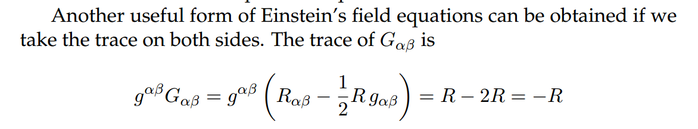

# Problem 2

Let's start with




## New Section
Equation

$$
x^2+y^2=1
$$

```python
import numpy as np
import matplotlib.pyplot as plt

x = np.linspace(-1, 1, 100)
y = np.sqrt(1-x**2)

plt.plot(x, y)
plt.plot(x, -y)
plt.show()
```

### Problem 2  

# **Investigating the Dynamics of a Forced Damped Pendulum**

## **1. General Description**
The forced damped pendulum is a fascinating example of nonlinear dynamics, where damping, restoring forces, and an external periodic force interact to produce complex behavior. Unlike a simple pendulum, which exhibits predictable periodic motion, a forced damped pendulum can display a range of behaviors, including resonance, quasiperiodicity, and chaos. 

This problem explores the governing equations, analytical approximations, and computational modeling of the system. By systematically varying the system parameters, we aim to understand its diverse solutions, practical applications, and relevance to real-world phenomena.

---

## **2. Useful Formulas and Definitions**
The equation of motion for a forced damped pendulum is given by:
$$\frac{d^2\theta}{dt^2} + b\frac{d\theta}{dt} + \frac{g}{L}\sin\theta = A\cos(\omega t)$$
where:
- $\theta$ is the angular displacement,
- $b$ is the damping coefficient,
- $g$ is the acceleration due to gravity,
- $L$ is the length of the pendulum,
- $A$ is the amplitude of the external forcing,
- $\omega$ is the driving frequency,
- $t$ represents time.

### **Linearized Approximation for Small Angles**
For small oscillations ($\theta \approx 0$), we can use the approximation $\sin\theta \approx \theta$ to simplify the equation:
$$\frac{d^2\theta}{dt^2} + b\frac{d\theta}{dt} + \frac{g}{L}\theta = A\cos(\omega t)$$
This results in a linear differential equation that can be solved using standard methods.

### **Resonance Condition**
When the driving frequency $\omega$ matches the natural frequency of the system, resonance occurs, leading to amplified oscillations. The natural frequency for small angles is given by:
$$\omega_0 = \sqrt{\frac{g}{L}}.$$
If the damping is small, the resonance frequency is approximately:
$$\omega_r \approx \omega_0 \sqrt{1 - \frac{b^2}{4\omega_0^2}}.$$

---

## **3. Examples and Computational Implementation**

### **Example 1: Analytical Solution for Small Angles**
For small angles and light damping, the general solution to the linearized equation is given by:
\[ \theta(t) = C e^{-\frac{b}{2}t} \cos(\omega_d t + \phi) + \theta_p(t) \]
where:
- $C$ and $\phi$ are constants determined by initial conditions,
- $\omega_d = \sqrt{\omega_0^2 - \frac{b^2}{4}}$ is the damped frequency,
- $\theta_p(t)$ is the particular solution due to forcing.

### **Example 2: Numerical Simulation in Python**
We use the Runge-Kutta method to numerically solve the nonlinear differential equation.
```python
import numpy as np
import matplotlib.pyplot as plt
from scipy.integrate import solve_ivp

def pendulum(t, y, b, g, L, A, omega):
    theta, omega_dot = y
    dtheta_dt = omega_dot
    domega_dt = -b * omega_dot - (g/L) * np.sin(theta) + A * np.cos(omega * t)
    return [dtheta_dt, domega_dt]

# Parameters
b, g, L, A, omega = 0.2, 9.81, 1.0, 0.5, 2.0
t_span = (0, 50)
t_eval = np.linspace(*t_span, 1000)
y0 = [0.1, 0]  # Initial conditions: small displacement, zero velocity

sol = solve_ivp(pendulum, t_span, y0, t_eval=t_eval, args=(b, g, L, A, omega))

# Plot results
plt.figure(figsize=(10, 5))
plt.plot(sol.t, sol.y[0], label='Theta (rad)')
plt.xlabel('Time (s)')
plt.ylabel('Angular displacement (rad)')
plt.title('Forced Damped Pendulum Motion')
plt.legend()
plt.grid()
plt.show()
```

### **Example 3: Phase Portrait and Chaos Exploration**
To investigate chaotic behavior, we plot phase space diagrams and Poincaré sections.

```python
plt.figure(figsize=(8, 6))
plt.plot(sol.y[0], sol.y[1], label='Phase space')
plt.xlabel('Theta (rad)')
plt.ylabel('Angular velocity (rad/s)')
plt.title('Phase Portrait of the Forced Damped Pendulum')
plt.legend()
plt.grid()
plt.show()
```

---

## **4. Discussion and Extensions**
### **Practical Applications:**
- **Mechanical Oscillators:** Suspension bridges and vehicle suspensions experience similar damping and forcing effects.
- **Electrical Circuits:** Driven RLC circuits share the same mathematical framework.
- **Energy Harvesting:** Devices that extract energy from oscillatory motion use resonance principles.

### **Further Studies:**
- **Chaotic Behavior:** For certain parameter values, the system exhibits chaos. Investigate bifurcation diagrams and Lyapunov exponents.
- **Nonlinear Damping:** Introducing nonlinear damping terms ($b(\theta)$) for more realistic modeling.
- **Non-Periodic Forcing:** Studying quasiperiodic and stochastic forcing effects.

---

## **5. Conclusion**
The forced damped pendulum is a rich system for studying nonlinear dynamics, resonance, and chaos. By combining analytical approximations with computational simulations, we gain deep insights into its behavior. The study of this system has significant implications across various fields of science and engineering.

This problem encourages further exploration into chaotic dynamics and the broader applications of forced oscillatory systems.
