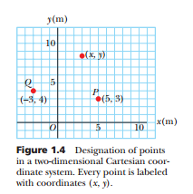

# Problem 1

## Circuits - Equivalent Resistance Using Graph Theory

#### Motivation:

**Calculating equivalent resistance** is a fundamental problem in electrical circuits, essential for understanding and designing efficient systems. While traditional methods involve iteratively applying series and parallel resistor rules, these approaches can become cumbersome for complex circuits with many components. Graph theory offers a powerful alternative, providing a structured and algorithmic way to analyze circuits.

By representing a circuit as a graph—where nodes correspond to junctions and edges represent resistors with weights equal to their resistance values—we can systematically simplify even the most intricate networks. This method not only streamlines calculations but also opens the door to automated analysis, making it particularly useful in modern applications like circuit simulation software, optimization problems, and network design.

Studying equivalent resistance through graph theory is valuable not only for its practical applications but also for the deeper insights it provides into the interplay between electrical and mathematical concepts. This approach highlights the versatility of graph theory, demonstrating its relevance across physics, engineering, and computer science.

